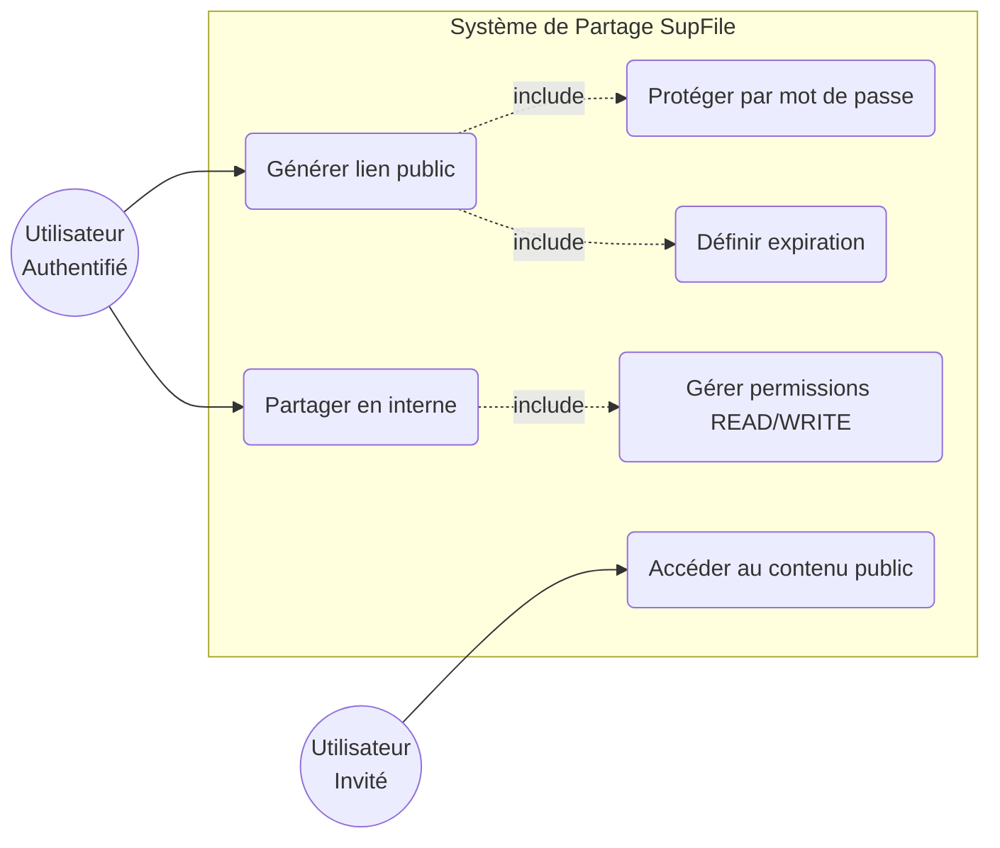

# 📁 Analyse du Projet SupFile API

## 1. Vue d'ensemble
**SupFile** est une API de stockage cloud permettant aux utilisateurs de gérer leurs fichiers et dossiers de manière sécurisée. Le projet est construit sur une architecture **Node.js/Express** avec une base de données **PostgreSQL** gérée via l'ORM **Prisma**.

## 2. Pile Technique (Tech Stack)
- **Backend** : Node.js avec Express.js.
- **Base de données** : PostgreSQL.
- **ORM** : Prisma (pour la modélisation et les requêtes).
- **Authentification** : JWT (JSON Web Tokens) stockés dans des cookies `HttpOnly` et intégration de Google OAuth via Firebase Admin.
- **Gestion de fichiers** : Multer pour l'upload, Archiver pour la compression ZIP à la volée.
- **Sécurité** : Bcrypt pour le hachage des mots de passe, validation des données d'entrée.

## 3. Modules Principaux

### 🔐 Authentification et Utilisateurs (`auth.controller.js`, `user.controller.js`)
- **Flux complet** : Inscription avec vérification d'email et réinitialisation de mot de passe.
- **OAuth** : Connexion simplifiée via Google.
- **Profil** : Gestion du nom, de l'email (avec re-vérification), du thème (clair/sombre) et de l'avatar.
- **Quotas** : Chaque utilisateur dispose d'un quota de stockage (par défaut 30 Go).

### ⭐ Favoris (`favorite.controller.js`)
- **Système de marquage** : Possibilité pour l'utilisateur de marquer des fichiers ou dossiers comme favoris.
- **Accès rapide** : Module dédié pour lister tous les éléments favoris de manière unifiée.

### 📂 Gestion de l'Arborescence (`folder.controller.js`, `file.controller.js`)
- **Organisation** : Création de dossiers et sous-dossiers. Un dossier racine "My Files" est créé automatiquement à l'inscription.
- **Navigation** : Système de "Fil d'Ariane" (Breadcrumbs) calculé dynamiquement pour faciliter la navigation dans l'interface.
- **Actions de fichiers** : Upload, renommage, déplacement, et prévisualisation (supportant le streaming pour les vidéos et l'affichage direct pour les PDF/images).
- **Cycle de vie** : Système de **Corbeille (Soft Delete)**. Les éléments sont d'abord marqués comme supprimés pour permettre la restauration, puis peuvent être supprimés définitivement pour libérer l'espace disque et mettre à jour le quota de l'utilisateur.

### 🤝 Partage (`sharing.controller.js`)
- **Partage Public** : Génération de liens via un jeton unique (nanoid). Possibilité d'ajouter un mot de passe et une date d'expiration sur le lien.
- **Partage Interne** : Collaboration entre utilisateurs inscrits sur des dossiers spécifiques avec des permissions définies (`READ` ou `WRITE`).
- **Héritage des droits** : Si un utilisateur a accès à un dossier parent, il accède récursivement aux sous-dossiers et fichiers.

### 📊 Tableau de Bord et Recherche (`dashboard.controller.js`)

## 4. Cas d'Utilisation : Système de Partage (UML)

Ce diagramme illustre les interactions entre les utilisateurs (propriétaires et invités) et les fonctionnalités de partage de la plateforme.

## 5. Justification des Choix Technologiques

### Backend : Node.js & Express.js
- **Efficacité I/O** : Le modèle non-bloquant de Node.js est idéal pour une application de stockage qui gère de nombreux flux de lecture/écriture simultanés (uploads et téléchargements).
- **Vitesse de développement** : Express permet de structurer rapidement une API REST robuste avec un middleware performant pour la gestion des erreurs et de la sécurité.

### Base de données : PostgreSQL & Prisma
- **PostgreSQL** : Choisi pour sa robustesse et sa capacité à gérer des relations complexes (arborescences de dossiers, permissions de partage héritées). L'extension `pg_trgm` permet d'offrir une recherche rapide et insensible à la casse.
- **Prisma (ORM)** : Offre une sécurité de type (Type-safety) intégrale. Les **transactions atomiques** de Prisma sont ici critiques : elles garantissent que si l'enregistrement d'un fichier échoue en base, le quota de stockage de l'utilisateur n'est pas décrémenté par erreur.

### Authentification : JWT & Firebase Admin
- **Stateless Auth** : L'utilisation de JSON Web Tokens (JWT) stockés dans des cookies `HttpOnly` offre un excellent compromis entre sécurité (protection contre XSS/CSRF) et scalabilité.
- **OAuth2** : L'intégration de Firebase Admin permet de déléguer la complexité de l'authentification Google, assurant une connexion rapide et sécurisée pour le grand public.

### Gestion de Fichiers : Multer & Archiver
- **Multer** : Standard de l'industrie pour gérer le multipart/form-data, permettant de valider les fichiers avant leur écriture sur le disque.
- **Archiver** : Utilisé pour générer des archives ZIP **à la volée** lors du téléchargement de dossiers. Cela évite de stocker des fichiers temporaires lourds sur le serveur et réduit l'utilisation de l'espace disque.

### Déploiement : Docker & Volumes
- **Isolations des dépendances** : Docker garantit que l'environnement (PostgreSQL version 15, Node version 18) est identique pour tous les développeurs.
- **Persistance locale** : Conformément au cahier des charges, les volumes Docker permettent de séparer le stockage physique des fichiers de la logique applicative, facilitant une future migration vers un stockage objet (type S3).

## 6. Modèle de Données (Prisma)
- **Statistiques** : Analyse de l'utilisation du stockage avec une répartition par type de média (Images, Vidéos, Documents, Audio, Autres) via des requêtes SQL brutes optimisées.
- **Recherche** : Moteur de recherche insensible à la casse utilisant l'extension `pg_trgm` de PostgreSQL, avec filtres par type et par date.

## 4. Modèle de Données (Prisma)
Le schéma est articulé autour de plusieurs entités clés :
- `User` : Stocke les infos profil, les secrets et les métriques de stockage.
- `Folder` & `File` : Représentent les objets stockés, liés entre eux de manière hiérarchique.
- `InternalShare` : Gère les permissions de collaboration.
- `PublicShare` : Gère les accès externes via jetons.
- `VerificationToken` : Utilisé pour les processus de sécurité (email, mot de passe).

## 5. Points Forts de l'Implémentation
1. **Transactions Atomiques** : Utilisation intensive de `prisma.$transaction` pour garantir l'intégrité des données (par exemple, mettre à jour l'espace utilisé par l'utilisateur au moment exact où le fichier est enregistré en base).
2. **Optimisation des performances** : Les statistiques du dashboard sont calculées côté base de données pour éviter de charger des milliers d'objets en mémoire Node.js.
3. **Sécurité** : Vérification systématique de la propriété (ownerId) ou des droits de partage avant toute action (lecture, écriture, suppression).
4. **Gestion des conflits** : Lors de l'upload ou du renommage, l'API gère automatiquement les doublons en ajoutant des suffixes (ex: `photo (1).jpg`).

## 6. Améliorations Possibles (Pistes de réflexion)
- **Nettoyage Automatique** : Un script planifié (cron) pour vider la corbeille après 30 jours.
- **Versionnage** : Garder un historique des versions lors du remplacement d'un fichier.
- **Calcul de taille de dossier** : Actuellement, la taille est stockée au niveau des fichiers ; un calcul agrégé pour les dossiers pourrait être utile.

---
*Analyse générée pour le projet SupFile-API.*